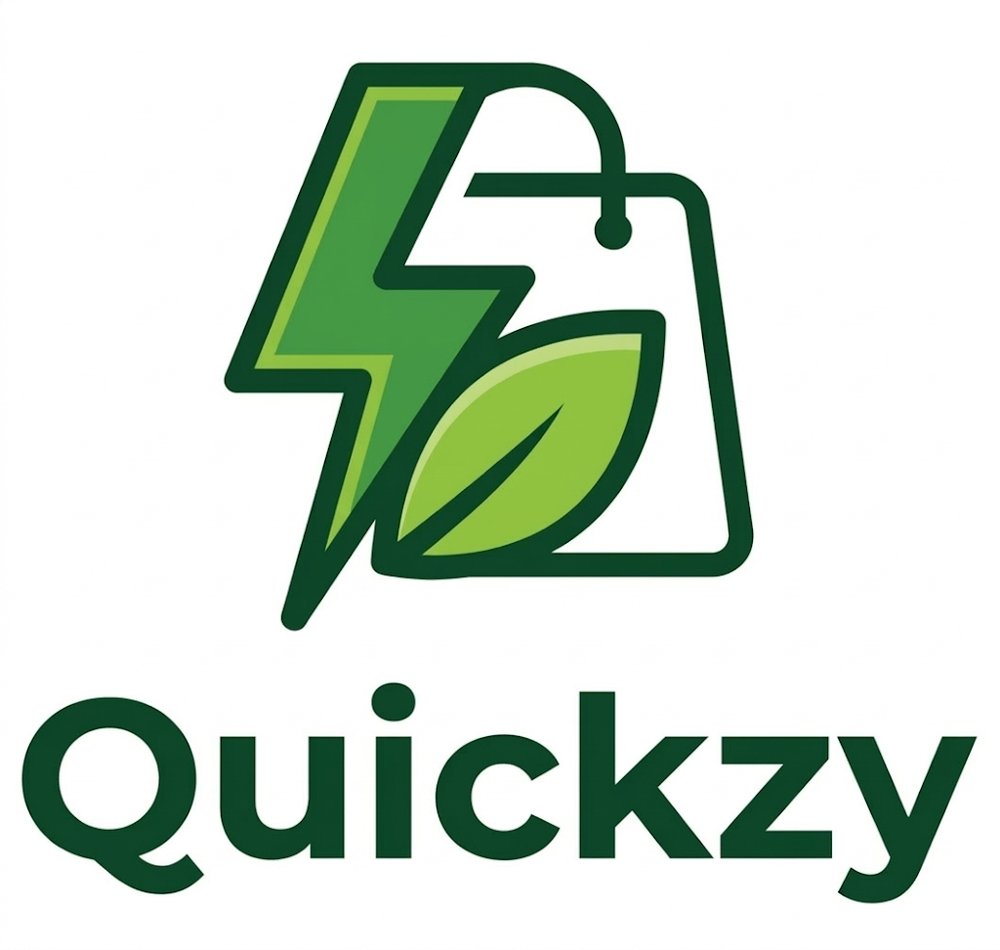

# ⚡ Quickzy: The High-Performance Quick Commerce Engine

<div align="center">
  
  <p><strong>Fast. Fresh. Delivered in a Zap.</strong></p>
  <p><em>A near-production-level implementation of hyper-local commerce logistics.</em></p>
</div>

---

## 🚀 Overview
**Quickzy** is not just a standard e-commerce site; it is a **Quick Commerce (Q-Commerce)** powerhouse designed to simulate the high-speed operational reality of modern delivery platforms like Zepto or Blinkit. This project represents hundreds of hours of engineering, focusing on real-time data synchronization, intensive UI/UX for both customers and admins, and a robust backend powered by the latest Next.js 16 features.

While architectural refinements have brought it **close to production level**, it remains a sophisticated simulation (dummy app) for demonstrating full-stack engineering proficiency.

---

## 🛠️ The Technical Stack

Quickzy is built on a modern "Monolithic-Plus" architecture, where a single robust framework handles both the client and the sensitive server logic.

### **Core Technologies**
- **Framework:** [Next.js 16.1.4](https://nextjs.org/) (App Router Architecture)
- **Library:** [React 19](https://react.dev/) (Utilizing the latest Concurrent features)
- **Styling:** [Tailwind CSS 4.0](https://tailwindcss.com/) (Modern, utility-first design system)
- **Database:** [MongoDB Atlas](https://www.mongodb.com/) (High-availability NoSQL cluster)
- **ODM:** [Mongoose 9.x](https://mongoosejs.com/) (Strict schema-based data modeling)
- **Authentication:** [NextAuth.js v4](https://next-auth.js.org/) (Secure session management)

### **Third-Party APIs & Services**
- **💳 Payments:** [Razorpay SDK](https://razorpay.com/) (Full digital payment flow simulation)
- **☁️ Media:** [Cloudinary API](https://cloudinary.com/) (Dynamic image optimization and storage)
- **📍 Geocoding:** [LocationIQ](https://locationiq.com/) (Reverse geocoding for delivery coordinates)
- **🗺️ Maps:** [Leaflet / React-Leaflet](https://leafletjs.com/) (Interactive location selection)
- **📧 Email:** [Resend API](https://resend.com/) (Transactional communication triggers)
- **🔔 Notifications:** [React-Toastify](https://fkhadra.github.io/react-toastify/) (Real-time feedback)

---

## 💎 Key Feature Ecosystem

### **1. The Consumer Experience (Front-End)**
- **📍 Mandatory Location Guard:** Access to the shop is restricted until delivery feasibility is confirmed via IP-based auto-detection or interactive map placement.
- **⚡ Zap Navigation:** Zero-latency page transitions using Next.js SPA routing and optimized hydration.
- **🛒 Smart Cart Engine:** 
  - Dynamic fee calculation (Delivery & Handling) based on order volume.
  - Real-time coupon validation with threshold-based unlocking logic.
  - **Auto-Sync Fingerprint:** Background price reconciliation to ensure the user never checks out with stale inventory data.
- **📖 Stories & Blog:** A full content delivery system featuring interactive newsletters and category-filtered technical updates.
- **🖥️ Responsive Account Hub:** Centralized management of profile settings, order history, and wishlists.

### **2. The Administrative Dashboard (Back-End Power)**
- **📊 Metric Overviews:** Real-time visibility into sales volume, order distribution, and catalog health.
- **📦 Inventory Lifecycle (CRUD):** A powerful UI for managing products with integrated Cloudinary asset cleanup (automatic storage reclamation).
- **🔄 Live Fulfillment Sync:** A dedicated Admin-only interface to transition orders from *Pending* to *Processing* and *Delivered*, reflecting instantly in the user's dashboard.
- **📱 High-Density Mobile UI:** Recently overhauled mobile dashboard that provides full administrative capability on phone screens via specialized card layouts.
- **🎫 Promotion Engine:** Direct control over promotional banners and dynamic discount coupons.

---

## 🏗️ Architectural Model: MVC in Next.js
Quickzy follows a modern interpretation of the **Model-View-Controller (MVC)** pattern, adapted for the serverless era:

- **Models:** Defined using **Mongoose Schemas** in `/models`. They act as the single source of truth for the data structure.
- **Actions (Controllers):** Implemented via **Next.js Server Actions** (`/actions`). These handle all project logic, database mutations, and security guards, abstracting the "Backend" away from the UI.
- **Views:** Built as **React Components** (`/components` and `/app`). Highly modular and reusable, with a "Mobile-First" philosophy.

---

## 📂 File & Folder Structure
```text
├── 📂 actions/             # Secure Server-Only Project Logic (Backend)
├── 📂 app/                 # Next.js App Router (Pages & Routing)
│   ├── 🛠️ admin/            # High-Level Administrative Panel
│   ├── 🛒 cart/             # Interactive Shopping Cart Experience
│   ├── 🏪 shop/             # Dynamic Product Catalog & Search
│   └── ...                 # Checkout, Blog, Profile, Wishlist
├── 📂 components/          # Reusable UI Atoms, Molecules & Organisms
├── 📂 context/             # Global Store (Cart, Wishlist, Location Providers)
├── 📂 db/                  # MongoDB Connection Pooling logic
├── 📂 models/              # Mongoose Database Schemas
├── 📂 public/              # Optimized Brand Assets & Manifests
├── 📂 scripts/             # Data Seeding, Exporting & Maintenance Tools
├── 📂 seed-data/           # JSON source of truth for Project Initialization
```

---

## 👥 User Roles & Access
| Feature | End User | Administrator |
| :--- | :---: | :---: |
| Browse Shop & Location Guard | ✅ | ✅ |
| Checkout & Razorpay Payment | ✅ | ✅ |
| View Order History | ✅ | ✅ |
| Manage Live Inventory (CRUD) | ❌ | ✅ |
| Fulfillment Status Toggle | ❌ | ✅ |
| CMS Control (Banners/News) | ❌ | ✅ |
| Genesis Admin Protection | ❌ | ✅ |

---

## ⚠️ Important Considerations (Project Maturity)
While this project is built to a **near-production** standard, specific enterprise-level logistics are simulated (Dummy Implementation):
1. **Real-time Tracking:** Order tracking is based on discrete status updates (Managed by Admin) rather than real-time GPS courier coordinates.
2. **Mobile Auth:** Authentication uses Magic Links and OAuth; production-level SMS-OTP gateways are not active.
3. **Extreme Scalability:** While most UI/UX is dynamic, certain specialized layout components use optimized hardcoding for performance and visual consistency.
4. **Volume Limits:** The architecture is designed for boutique/enterprise demo use and is not currently tuned for the infrastructure of 1M+ concurrent users.

---

## 🛠️ Getting Started

### **Prerequisites**
- **Node.js 18+**
- **MongoDB Atlas** Account
- **Cloudinary** Developer Credentials
- **Razorpay** API Keys (Test Mode)

### **Installation**
1. **Clone:** `git clone https://github.com/pjha91275/Quickzy.git`
2. **Install:** `npm install`
3. **Environment:** Copy `.env.example` to `.env.local` and fill in your keys.
4. **Initialize:** `npm run seed` (Uploads initial products to DB)
5. **Launch:** `npm run dev`

---

**Built to Deliver in a Zap ⚡ by Prince Jha**
